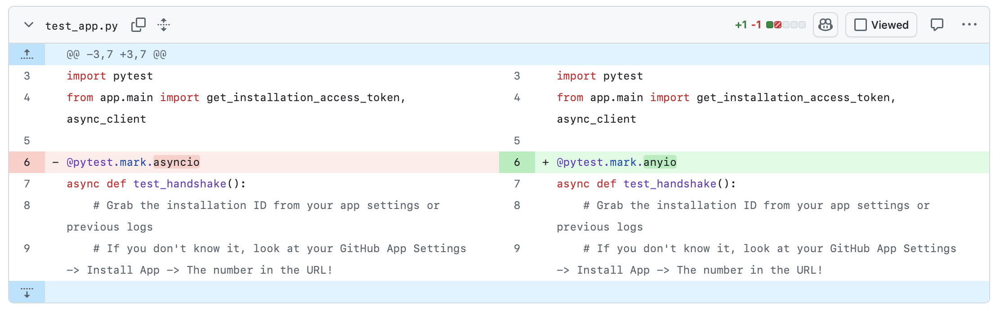

# Production-Grade Automated AI PR Reviewer Engine 

**An asynchronous, containerized AI code review engine built with FastAPI, Docker, and Groq.**

## 📷 Live Demo & System Proof



## 🧠 Engineering Decisions & Core Tradeoffs

- **Asynchronous vs. Synchronous Webhook Processing**: Leverages FastAPI `BackgroundTasks` to establish an instant `202 Accepted` handshake. This gracefully bypasses GitHub's strict 10-second webhook timeout and executes deep LLM analysis safely out-of-band.
- **Noise Mitigation via Unified Batched Reviews**: Eliminates fragile custom diff arithmetic by grouping all line annotations into a single structured JSON array. Native GitHub `POST /reviews` batched mutations are used to prevent comment spam and minimize API latency.
- **Prompt Fencing & Input Isolation**: Hardened against prompt injection attacks by securely wrapping untrusted code patches inside literal string token boundaries (e.g., `[START OF UNTRUSTED CODE DATA]`).

An asynchronous, containerized, and security-hardened GitHub App engine that delivers multi-dimensional code reviews. Powered by a single-payload LLM routing pipeline, this platform conducts structural syntax checking, highlights security vulnerabilities, evaluates architectural impact, and publishes structured, batch-aligned reviews directly onto pull request threads natively.

---

## System Architecture

Unlike standard synchronous AI wrappers that block request flows and trigger GitHub webhook timeouts, this engine is built around an out-of-band asynchronous dispatch model. 

### Core Architectural Mechanics:
1. **Asynchronous Edge Router:** The FastAPI endpoint processes incoming GitHub `X-Hub-Signature-256` HMAC authentications, parses webhooks, drops an instantaneous `202 Accepted` network frame to clear GitHub's strict 10-second window, and instantly hands off processing to local `BackgroundTasks`.
2. **Unified Single-Payload Exchange:** Instead of executing separate, expensive API loops for top-level summaries and line reviews (which hit free-tier token gates and add heavy latency), the orchestrator passes an isolated context envelope to Groq. It extracts a highly structured, single JSON object containing both the markdown report and pinpoint inline critiques simultaneously.
3. **Native Batched Mutation:** Relies entirely on GitHub's modern Review API (`POST /pulls/{pr}/reviews`). It completely strips away fragile regex parsing and volatile diff-position arithmetic by injecting raw line targets and explicit `"side": "RIGHT"` alignments directly into unified collection objects.

---

## Feature Breakdown & Hardening

* **Prompt Fencing Guardrails:** Protects against active prompt-injection attacks. Code patches are tightly sandboxed inside explicit `[START OF UNTRUSTED CODE DATA]` structural boundaries, accompanied by system instructions forcing the core model to treat incoming characters purely as literal string payloads for static evaluation.
* **Deterministic Configuration Lifecycle:** Mitigates risk by stripping out local file globbing for credential detection. Cryptographic asymmetric `.pem` RSA keys are systematically parsed directly from injected, environment-isolated configurations managed safely inside Docker boundaries.
* **Hermetic Container Build:** Fully packaged via a multi-stage `Dockerfile` running Python slim runtimes to freeze dependency layers (`requirements.txt`), ensuring absolute portability between local validation environments and live cloud runtimes (Render/Railway).

---

## Empirical Evaluation & Quality Engineering

To prevent system drift and curb the number-one defect of AI tooling—hallucinations and false positives—this project includes a dedicated, empirical verification harness. The review system does not just prompt a model; it metrics-tests it.

Run the internal accuracy benchmark locally using:
```bash
python3 scripts/evaluate_reviewer.py
```
